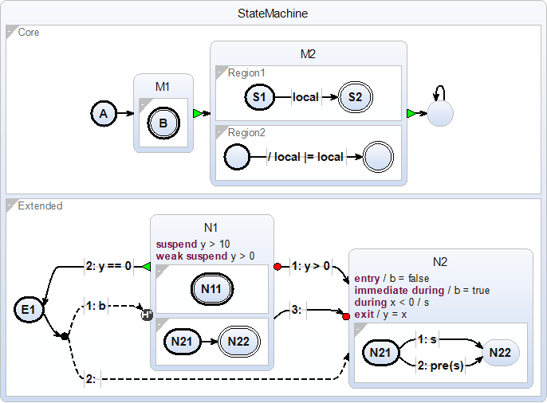

# Statemachine Compiler - Documentation

## Syntax Examples
These examples should provide some basic overview over the language used in the statemachine compiler.

### Feature Showcase (examples/Showcase.sctx)

This model shows most (not all) features of the underlying SCCharts language.
Everything is named individually so matching parts of the diargam to the code should be self explanatory.

~~~
scchart StateMachine {
    input bool b
    input output int x
    output float y = 0.0

    region Core {
        initial state A
        go to M1

        state M1 {

            initial final state B
        }
        join to M2

        state M2 {
            bool local

            region Region1 {
                initial state S1
                if local go to S2

                final state S2
            }

            region Region2 {
                initial state S3 ""
                do local |= local go to S4

                final state S4 ""
            }
        }
        join to S5

        state S5 ""
        go to S5
    }

    region Extended {
        initial state E1
        go to C

        connector state C
        immediate if b go to N1 history
        immediate go to N2

        state N1 {
            suspend if y > 10
            weak suspend if y > 0

            region {
                initial final state N11
            }

            region {
                initial state N21
                go to N22

                final state N22
            }
        }
        if y > 0 abort to N2
        if y==0 join to E1
        go to N2 deferred

        state N2 {
            signal s
            entry do b = false
            immediate during do b = true
            during if x < 0 do s
            exit do y = x

            initial state N21
            if s go to N22
            if pre(s) go to N22

            state N22
        }
    }
}
~~~